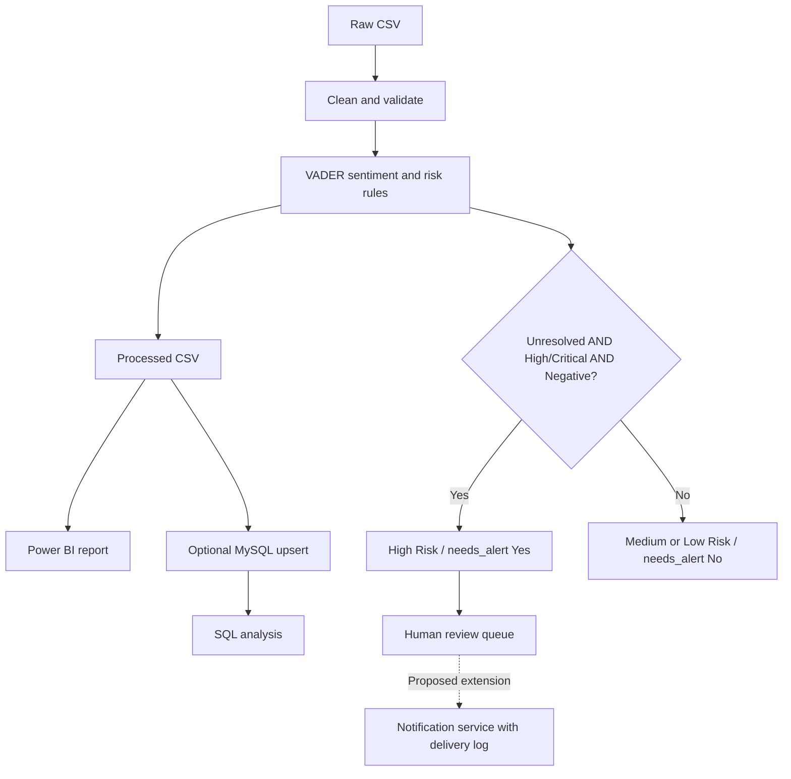

# AI-Assisted Customer Support Ticket Analytics & Risk Monitoring

A portfolio project using Python, MySQL, SQL, VADER sentiment analysis, and Power BI to explore support workload, customer ratings, and rule-based review priorities.

The analysis retains **8,469 tickets**. It flags **791 unresolved tickets** with High/Critical priority and negative VADER sentiment for review. It does not send notifications or predict whether a ticket will escalate.

## Business questions

- Which issue types, channels, statuses, and priorities account for the support workload?
- Which products and issue types have lower average customer ratings?
- How does elapsed time from first response to resolution vary across priorities?
- Which unresolved tickets meet the defined high-risk rule?

## Dataset and metric definitions

Dataset source: [Customer Support Ticket Dataset on Kaggle](https://www.kaggle.com/datasets/suraj520/customer-support-ticket-dataset), as identified in the project brief. Download the source CSV and place it at `data/raw/customer_support_tickets.csv`. Review the source's current terms before redistributing its data.

The source contains ticket IDs, subject/description, product, priority, status, channel, purchase date, first-response and resolution timestamps, and satisfaction ratings. Customer contact fields are not displayed in the portfolio screenshots. CSVs and imported-data PBIX files are excluded from Git by default; the scripts reproduce the processed files locally.

| Metric | Definition | Full-dataset result |
|---|---|---:|
| Total tickets | One row per unique ticket ID | 8,469 |
| Unresolved tickets | Open or Pending Customer Response | 5,700 |
| Unresolved share | Unresolved / all tickets | 67.3% |
| High-risk tickets | Unresolved + High/Critical priority + Negative sentiment | 791 |
| High-risk share | High risk / unresolved | 13.9% |
| Critical high-risk tickets | High risk with Critical priority | 399 |
| Open high-risk tickets | High risk with Open status | 401 |
| Average satisfaction | Mean of non-missing ratings from 1 to 5 | 2.99 / 5 |
| Rated tickets | Records with a valid rating | 2,769 |
| Average response-to-resolution | Resolution timestamp minus first-response timestamp, valid nonnegative values only | 7.58 hours |
| Valid duration tickets | Non-missing nonnegative durations | 1,404 |
| Invalid durations | Resolution precedes first response | 1,365 |

These are descriptive results from this dataset, not a live support operation or a measured business improvement.

## Dashboard

The report has three pages and keeps question-style chart titles.

### Executive Overview

Shows overall volume, unresolved workload, high-risk count, and average satisfaction, with issue-type, status, channel, and priority breakdowns. The purchase date is not used as a ticket-arrival trend.


### Support Performance Analysis

Shows response-to-resolution hours, valid-duration count, average satisfaction, and rating count. It includes satisfaction by issue type, duration by priority, the top five products by average satisfaction, and a product-level duration-vs-satisfaction scatterplot. Each scatter point represents one product; its duration and satisfaction averages may use different available records.


### AI Risk Monitoring

Shows high-risk count/share, Critical and Open high-risk counts, high-risk tickets by priority, VADER sentiment distribution, and a review queue without customer contact information. The queue is filtered to `needs_alert = Yes`.


These screenshots show the current working report. The separate [design mockups](design/) and [Power BI finishing guide](docs/POWER_BI_FINISHING_GUIDE.md) describe the proposed final visual refinements; they are not screenshots of an implemented redesign. Slicer visuals are present on each page; cross-page synchronization must be configured explicitly if desired.

## Cleaning and analysis

1. Standardize column names and strip text whitespace.
2. Remove exact duplicate rows; reject conflicting duplicate ticket IDs.
3. Parse dates and timestamps.
4. Retain missing ratings as missing; exclude out-of-range ratings.
5. Calculate response-to-resolution hours. Flag negative durations and set only the duration to missing, retaining the entire ticket.
6. Create age groups with explicit boundaries: Under18, 18–25, 26–35, 36–45, 46–60, 61+.
7. Score subject plus description with VADER and apply transparent risk rules.
8. Export the AI-ready CSV for Power BI and optional MySQL import.

## Sentiment and risk rules

VADER is a lexicon/rule-based sentiment baseline. Compound scores >=0.05 are Positive, <=−0.05 are Negative, and scores between those thresholds are Neutral. The labels have not been validated against a human-reviewed sample and should not be treated as satisfaction ratings or probabilities.

| Condition | Risk |
|---|---|
| Unresolved AND High/Critical priority AND Negative sentiment | High Risk |
| Unresolved AND either High/Critical priority OR Negative sentiment | Medium Risk |
| Other recognized cases | Low Risk |

`needs_alert = Yes` identifies High Risk cases eligible for review or a future notification workflow. Missing or unknown status/priority values cause validation to stop rather than silently treating them as unresolved.



## Verified findings

- Refund Request is the largest issue category, **1,752 tickets**, just ahead of Technical Issue, **1,747**. The five issue categories have similar volumes.
- Channels are also similar: Email **2,143**, Phone **2,132**, Social Media **2,121**, and Chat **2,073**. These counts alone do not justify a major staffing shift.
- The rule flags **791 tickets**: **399 Critical** and **392 High**; **401 Open** and **390 Pending Customer Response**.
- **1,365 of 2,769 closed-ticket durations are invalid (49.3%)**. Duration averages therefore describe only the valid subset, not all closed tickets.
- Ratings average **2.99/5** across **2,769 rated tickets**. Missing responses are excluded rather than scored as zero.
- Across 42 products, the Pearson correlation between product-average valid duration and product-average satisfaction is approximately **−0.083**. This is weak descriptive evidence, not a causal result; the two averages may come from different samples.
- The five products with the most tickets account for about **13.4%** of volume. There is no evidence here that a few products dominate support volume, and ticket counts are not defect rates without sales/usage denominators.

## Recommendations

1. Review flagged Critical cases first, while retaining human judgment and validating sentiment labels.
2. Investigate timestamp inconsistencies before using duration figures for service-level decisions.
3. Report rating and valid-duration sample sizes beside averages.
4. Obtain ticket-created timestamps before analyzing arrival trends, backlog age, or full resolution time.
5. If adding alerts, implement delivery logging and deduplication; a flag alone is not proof of notification.

## Run locally

Use Python 3.10 or later. From the project root:

```powershell
py -m venv .venv
.\.venv\Scripts\python.exe -m pip install -r requirements.txt
.\.venv\Scripts\python.exe python/01_data_understanding.py
.\.venv\Scripts\python.exe python/02_clean_data.py
.\.venv\Scripts\python.exe python/03_sentiment_and_risk.py
.\.venv\Scripts\python.exe -m unittest discover -s tests -v
```

Import `data/processed/support_tickets_ai_ready.csv` into Power BI, or refresh your existing query. It contains 25 columns. If the Source step fixes the count at24, change it to25 or remove that fixed Columns option. Preserve the existing table name to keep measures and visuals connected.

For MySQL setup and upgrading the old importer, follow [INSTALL.md](docs/INSTALL.md). The new importer uses a password prompt or environment variables, explicit schema, and primary-key upserts. It does not drop the table and does not remove rows absent from an input CSV. Verify totals afterward using `sql/03_validation.sql`.

## Repository contents

```text
python/          Complete profiling, cleaning, sentiment/risk, and MySQL scripts
sql/             Schema, analysis queries, and read-only validation
tests/           Boundary and risk-rule checks
data/raw/        Download source CSV locally
data/processed/  Generated locally
dashboard/       Current screenshots, DAX reference, theme
design/          Proposed final mockups (not implemented PBIX pages)
docs/            Installation, review findings, dashboard finishing guide
requirements.txt
```

Keep the existing PBIX locally; this package does not modify or replace its report/model internals. If publishing a PBIX, inspect its embedded data first and explicitly opt it into Git after review.

## Validation and limitations

The replacement pipeline was run against the full raw dataset and reproduced the existing 8,469-row IDs, status/priority, sentiment scores/labels, risk flags, missingness, satisfaction values, and durations. Seven focused tests cover timestamp retention, age boundaries, conflicting IDs, unknown status, missing text, sentiment thresholds, and the risk-rule truth table. Import-record serialization was checked separately; MySQL statement execution and live Power BI/DAX execution were not performed during the review.

Human sentiment validation, notification delivery, live monitoring, and measured business impact remain future work.
